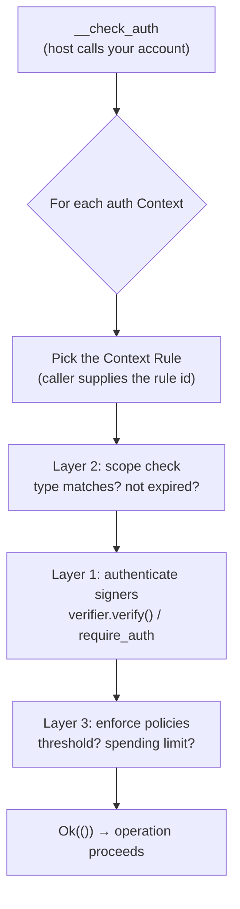
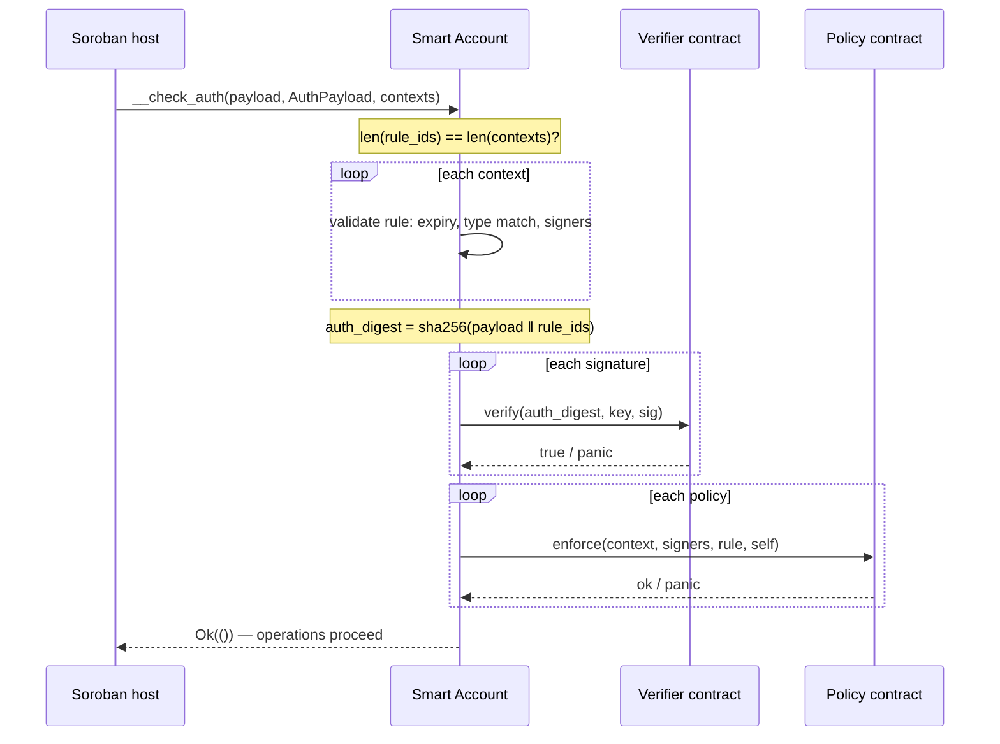

# Smart Accounts on Stellar: How OpenZeppelin's Standard Works

> **Series — Smart Accounts on Stellar, Part 1 of 5.** This post explains the
> standard. [Part 2](./02-how-g2c-uses-oz-smart-accounts.md) shows how we wired
> it into [Nido](https://nido.fyi), a passkey wallet with no seed phrase. See
> the [series index](./README.md) for the full roadmap.

At Nido, our north star is embarrassingly simple to state and surprisingly hard
to deliver: **a self-custodial Stellar account you unlock with Face ID and a
tap — no seed phrase, no browser extension, no "write these 24 words on paper."**

The thing standing between us and that experience is the *account model*. On most
blockchains an account *is* a keypair: one private key, full control, lose it and
it's gone forever. Passkeys can't fit into that model, because a passkey's private
key never leaves your device's secure enclave — you can't paste it into a wallet,
and it isn't an ed25519 key Stellar natively understands.

Smart accounts flip the model. An account stops being a keypair and becomes a
**program that decides what "authorized" means.** That program can say "a P-256
passkey signature counts," or "this session key may call the DEX but nothing
else," or "two of my three friends can together recover me." That flexibility is
the whole game — and on Soroban, OpenZeppelin ships a standard for it that you
*compose with* instead of reinventing.

This post is the foundation: what Soroban gives you natively, what OpenZeppelin's
[`stellar-accounts`](https://github.com/OpenZeppelin/stellar-contracts) library
adds on top, and the three-layer mental model — **signers, context rules,
policies** — that everything else builds on. Code is from the library source
pinned in our repo (`stellar-accounts @ 637c53a`, soroban-sdk 26).

---

## Soroban already lets every contract be an account

Here's the primitive most chains don't have: on Soroban, **any contract can
authorize transactions on its own behalf** by implementing one trait. When the
host needs to check whether an operation attributed to a contract address is
allowed, it calls that contract's `__check_auth`:

```rust
// soroban_sdk::auth::CustomAccountInterface — the native hook
pub trait CustomAccountInterface {
    type Signature;
    type Error;

    fn __check_auth(
        e: Env,
        signature_payload: Hash<32>,     // the digest the host wants authorized
        signatures: Self::Signature,     // YOUR custom proof type
        auth_contexts: Vec<Context>,     // one entry per require_auth() in the tx
    ) -> Result<(), Self::Error>;
}
```

Three arguments, and the whole model lives in them:

- **`signature_payload`** — a 32-byte digest binding this authorization to a
  specific invocation (nonce, expiration ledger, network, and the invocation
  tree). Sign *this*, not some replayable message.
- **`auth_contexts`** — the list of operations being authorized. Each
  [`Context`](https://docs.rs/soroban-sdk/latest/soroban_sdk/auth/enum.Context.html)
  is one `require_auth()` call: a contract function call
  (`Contract(ContractContext { contract, fn_name, args })`) or a contract
  deployment. If your account authorizes a token transfer *and* a swap in one
  transaction, you get two contexts.
- **`signatures`** — and this is the clever part: the type is **yours**. Whatever
  you put in `Self::Signature`, the caller must supply and you get to interpret.
  A single ed25519 signature? A map of passkey assertions? A multisig bundle? Your
  contract decides.

Return `Ok(())` and the operations proceed. Return an error (or panic) and the
whole transaction reverts.

That's enormously powerful — and completely raw. Soroban hands you the hook and
nothing else. **Everything that makes an account *useful* you have to build
yourself.**

### What you'd have to build by hand

Implement `__check_auth` from scratch for a real wallet and you immediately owe
yourself:

- multiple signers, and a way to **rotate** them when a device is lost;
- **multisig** thresholds (2-of-3, N-of-M);
- **scoped session keys** — a key that can call one contract, for one week, then
  expires;
- **spending limits** and other per-operation policy;
- **social recovery** — let trusted friends restore access;
- correct **replay binding** so a signature for one operation can't be reused for
  another;
- and a **pluggable signature scheme** so you can verify *passkeys* (secp256r1),
  not just Stellar's native ed25519.

Every one of those is a place to introduce a subtle, fund-draining bug. This is
exactly the surface OpenZeppelin's `stellar-accounts` covers — and it does it
with a model worth understanding before you write a line of account code.

---

## The mental model: three composable layers

OpenZeppelin's smart account separates authorization into **three layers that
compose independently**:

| Layer | Question it answers | Concept |
|-------|---------------------|---------|
| **Signers** | *Who* is proving they approved this? | `Signer` (delegated or verifier-backed) |
| **Context Rules** | *What* may they authorize, and for how long? | `ContextRule` + `ContextRuleType` |
| **Policies** | *Under what extra conditions?* | `Policy` (threshold, spending limit, …) |

The library's own docs describe the design as **context-centric**: instead of
reasoning key-first ("which keys signed?"), you reason scope-first ("what is
being authorized, and what does *that* require?"). If you've built OAuth scopes,
it'll feel familiar — the focus is on the permission being granted, not the raw
credential.



Let's take the layers one at a time.

---

## Layer 1 — Signers (authentication: *who*)

A signer is an identity that can prove approval. The library models exactly two
kinds:

```rust
// stellar-accounts: smart_account/storage.rs
pub enum Signer {
    /// A delegated signer that uses built-in signature verification.
    Delegated(Address),
    /// An external signer with custom verification logic.
    /// Contains the verifier contract address and the public key data.
    External(Address, Bytes),
}
```

- **`Delegated(Address)`** — defer to another Soroban address's *own*
  authorization. Under the hood the account calls `addr.require_auth_for_args(...)`,
  so the delegated party authorizes through a normal (possibly nested) Soroban
  auth entry. This is how one smart account can name *another account* as a
  signer — the basis for social recovery, where your "friends" are themselves
  accounts.
- **`External(Address, Bytes)`** — the extensibility seam. The first field is a
  **verifier contract**; the second is opaque **key data**. When this signer
  needs to be authenticated, the account makes a cross-contract call to the
  verifier and asks: *is this signature valid for this key and this digest?*

That `External` variant is why passkeys are possible at all. Stellar's host can
verify ed25519 natively, but a passkey is a **secp256r1 (P-256)** key living in
hardware. By making verification a *contract call*, OpenZeppelin lets you bolt on
any scheme — you just implement the `Verifier` trait:

```rust
// stellar-accounts: verifiers/mod.rs
pub trait Verifier {
    type KeyData: FromVal<Env, Val>;
    type SigData: FromVal<Env, Val>;

    /// Returns true iff `sig_data` is a valid signature over `hash` for `key_data`.
    fn verify(e: &Env, hash: Bytes, key_data: Self::KeyData, sig_data: Self::SigData) -> bool;

    /// Maps any byte representation of a key to ONE canonical identity, so the
    /// account can detect "two signers, same underlying key" (prevents bypassing
    /// an N-of-M threshold with the same key registered twice).
    fn canonicalize_key(e: &Env, key_data: Self::KeyData) -> Bytes;

    fn batch_canonicalize_key(e: &Env, key_data: Vec<Self::KeyData>) -> Vec<Bytes>;
}
```

The library ships reference verifiers for **ed25519** and **WebAuthn**
(passkeys). A verifier is *stateless* — it holds no per-account data, so you
deploy it once and every smart account shares it. We'll see Nido's WebAuthn
verifier (all of ~50 lines) in Part 2.

---

## Layer 2 — Context Rules (scope and routing: *for what*)

A signer that can authorize *anything* is just a private key with extra steps.
The power comes from **scoping** — and that's what a context rule does. Each rule
binds a set of signers (and policies) to a particular kind of operation:

```rust
// stellar-accounts: smart_account/storage.rs
pub enum ContextRuleType {
    /// Matches any context.
    Default,
    /// Matches calls to one specific contract.
    CallContract(Address),
    /// Matches deploying a contract with one specific WASM hash.
    CreateContract(BytesN<32>),
}

pub struct ContextRule {
    pub id: u32,
    pub context_type: ContextRuleType,
    pub name: String,                 // human-readable, e.g. "session" or "recovery"
    pub signers: Vec<Signer>,
    pub signer_ids: Vec<u32>,         // global registry ids, aligned with `signers`
    pub policies: Vec<Address>,
    pub policy_ids: Vec<u32>,         // aligned with `policies`
    pub valid_until: Option<u32>,     // optional expiry, as a ledger sequence
}
```

This one struct unlocks most of the wallet features you'd otherwise hand-roll:

- A **`Default`** rule with your primary passkey → your everyday signer that can
  authorize anything. (This is the rule Nido seeds at account creation.)
- A **`CallContract(dex_address)`** rule with a throwaway key and
  `valid_until: Some(ledger)` → a **session key** that can trade on one DEX for
  one week and then is dead weight on-chain. No core changes, no custom code.
- A **`CallContract(self)`** rule whose signers are your friends → a
  **recovery** rule that can call *your own account's* `add_signer` /
  `remove_signer` but can't touch your funds.

Crucially, **multiple rules can coexist for the same context type.** You might
have an "admin" rule (3-of-3) *and* a "daily" rule (1 passkey) both scoped to the
same token contract. The account doesn't guess which applies — as we'll see, the
*caller* names the rule it's invoking.

Constraints worth knowing up front: a rule may hold up to **15 signers** and
**5 policies**, must have at least one of either, and external key data is capped
at **256 bytes**.

---

## Layer 3 — Policies (enforcement: *under what conditions*)

Signers prove *who*; context rules bound *what*. Policies add **programmable
conditions** on top — "at least M of you," "no more than X per week." A policy is
its own contract implementing:

```rust
// stellar-accounts: policies/mod.rs
pub trait Policy {
    type AccountParams: FromVal<Env, Val>;

    /// Called during authorization. Validates AND may mutate state
    /// (e.g. decrement a spending budget). PANICS if the condition fails.
    fn enforce(
        e: &Env,
        context: Context,
        authenticated_signers: Vec<Signer>,  // who passed Layer 1 for this rule
        context_rule: ContextRule,
        smart_account: Address,
    );

    /// Called when the policy is attached to a rule (store config, validate).
    fn install(e: &Env, install_params: Self::AccountParams, context_rule: ContextRule, smart_account: Address);

    /// Called when the policy is detached (clean up).
    fn uninstall(e: &Env, context_rule: ContextRule, smart_account: Address);
}
```

The library provides ready-made building blocks: **`simple_threshold`** (plain
M-of-N), **`weighted_threshold`** (weighted voting), and **`spending_limit`** (a
rolling-window cap). Enforcement is **all-or-nothing**: every policy attached to
a rule must pass.

`simple_threshold` is the one Nido uses for recovery, and it's the simplest
possible: store a number, then at enforce time check that enough authenticated
signers showed up.

```rust
// stellar-accounts: policies/simple_threshold.rs
pub struct SimpleThresholdAccountParams {
    /// The minimum number of signers required for authorization.
    pub threshold: u32,
}
```

> **A real footgun, called out by the library itself.** A threshold policy stores
> its number at *install* time and is **not** notified when signers are later
> added or removed from the rule. Add two signers to a strict 3-of-3 and you
> silently have a 3-of-5. Remove two and your 5-of-5 becomes *impossible to
> satisfy* — a permanent lockout. The fix is procedural: always call the policy's
> `set_threshold` in the same transaction you change the signer set. We mention it
> here because it's exactly the kind of thing a from-scratch implementation gets
> wrong, and the standard at least makes it explicit.

---

## Putting it together: the authorization algorithm

Now the payoff. The caller's proof type — `Self::Signature` from way back at the
top — is this struct:

```rust
// stellar-accounts: smart_account/storage.rs
pub struct AuthPayload {
    /// Each signer mapped to its raw signature bytes.
    pub signers: Map<Signer, Bytes>,
    /// Which rule to validate for each auth context, aligned by index
    /// with `auth_contexts`.
    pub context_rule_ids: Vec<u32>,
}
```

Two pieces that can't be derived from each other: the **signatures** themselves,
and a **per-context rule selection**. Because multiple rules can match the same
context, the caller must explicitly say *"authorize context 0 using rule 1."*
`context_rule_ids[i]` is the rule for `auth_contexts[i]`.

Your account's `__check_auth` delegates the entire algorithm to one library
function, `do_check_auth`. Here it is, lightly trimmed:

```rust
// stellar-accounts: smart_account/storage.rs (trimmed)
pub fn do_check_auth(
    e: &Env,
    signature_payload: &Hash<32>,
    signatures: &AuthPayload,
    auth_contexts: &Vec<Context>,
) -> Result<(), SmartAccountError> {
    // 1. One rule id per context — no more, no less.
    if signatures.context_rule_ids.len() != auth_contexts.len() {
        panic_with_error!(e, SmartAccountError::ContextRuleIdsLengthMismatch);
    }

    // 2. Validate each context against its chosen rule (expiry, type match, signers).
    let validated_contexts = Vec::from_iter(e, auth_contexts.iter().enumerate().map(|(i, context)| {
        let all_signers = signatures.signers.keys();
        let rule_id = signatures.context_rule_ids.get_unchecked(i as u32);
        get_validated_context_by_id(e, &context, &all_signers, rule_id)
    }));

    // Collect the union of signers allowed by the selected rules.
    let mut allowed_signers = Map::new(e);
    for (rule, _, _) in validated_contexts.iter() {
        for signer in rule.signers.iter() { allowed_signers.set(signer, ()); }
    }

    // 3. Bind the rule selection into the signed digest — the heart of replay safety.
    let mut preimage = signature_payload.to_bytes().to_bytes();
    preimage.append(&signatures.context_rule_ids.clone().to_xdr(e));
    let auth_digest = e.crypto().sha256(&preimage);

    // 4. Authenticate every supplied signature; reject signers not in any rule.
    for (signer, sig_data) in signatures.signers.iter() {
        if !allowed_signers.contains_key(signer.clone()) {
            panic_with_error!(e, SmartAccountError::UnauthorizedSigner);
        }
        authenticate(e, &auth_digest, &signer, &sig_data);
    }

    // 5. Enforce every policy on every validated rule.
    for (rule, context, matched_signers) in validated_contexts.iter() {
        for policy in rule.policies.iter() {
            PolicyClient::new(e, &policy).enforce(&context, &matched_signers, &rule, &e.current_contract_address());
        }
    }
    Ok(())
}
```

Walking the five steps:

**1. Length check.** Exactly one rule id per context. A mismatch is an instant
reject — there's no auto-discovery, the caller must be explicit.

**2. Scope validation** (`get_validated_context_by_id`). For each `(context,
rule_id)`: reject if the rule is **expired** (`valid_until < current ledger`),
reject if the rule's **type doesn't match** the context (a `Default` rule matches
anything; a `CallContract(X)` rule only matches calls to `X`), then figure out
which of the rule's signers are present in the payload. If the rule has **no
policies**, *all* its signers must be present; if it has policies, that decision
is deferred to the policy.

**3. Digest binding** — the security crux. Signers don't sign the raw
`signature_payload`; they sign
`sha256(signature_payload ‖ context_rule_ids.to_xdr())` (the rule ids are
XDR-encoded, then appended). This **binds the signature to the exact rule
selection.** An attacker who
intercepts a signature authorized under a restrictive rule can't replay it under
a more permissive one — changing the rule ids changes the digest, invalidating
every signature. (Concretely: this is why our SDK's WebAuthn challenge is the
*auth digest*, not the host's payload — Part 2 shows that wiring.)

**4. Authentication** (`authenticate`). For each supplied signature, first reject
any signer that isn't part of *some* selected rule (this stops an attacker from
smuggling in an arbitrary verifier contract). Then:

```rust
// stellar-accounts: smart_account/storage.rs
pub fn authenticate(e: &Env, auth_digest: &Hash<32>, signer: &Signer, sig_data: &Bytes) {
    match signer {
        Signer::External(verifier, key_data) => {
            let sig_payload = auth_digest.to_bytes().to_bytes();
            if !VerifierClient::new(e, verifier).verify(&sig_payload, &key_data.into_val(e), &sig_data.into_val(e)) {
                panic_with_error!(e, SmartAccountError::ExternalVerificationFailed)
            }
        }
        Signer::Delegated(addr) => {
            let args = (auth_digest.clone(),).into_val(e);
            addr.require_auth_for_args(args)
        }
    }
}
```

An `External` signer routes to its verifier contract; a `Delegated` signer routes
to that address's own Soroban auth. Same digest either way.

**5. Policy enforcement.** Finally, every policy on every validated rule runs its
`enforce` — threshold met? under the spending cap? — and panics if not.



Three properties fall out of this design that are easy to get wrong by hand:
**rule-selection binding** (step 3), **unauthorized-signer rejection** (step 4),
and **canonical de-duplication** (a verifier's `canonicalize_key` stops the same
key being registered twice to cheat a threshold).

---

## Passkeys, in one paragraph (the full story is Part 3)

The reason all of this matters for Nido: the WebAuthn verifier turns a browser
passkey assertion into a yes/no. It checks the `clientDataJSON` says
`"webauthn.get"`, that its `challenge` is the base64url of our digest, that the
authenticator flags include **User Present** and **User Verified**, then verifies
a **secp256r1** signature over `sha256(authenticatorData ‖ sha256(clientDataJSON))`.
That's it — a passkey becomes a Soroban signer, and `canonicalize_key` strips the
per-session credential-ID tail so the same passkey is always recognized as the
same key. We'll dissect every byte of that in Part 3.

---

## Why this matters for builders

The point of the standard isn't that it implements multisig for you. It's the
**shape**:

- Want a new signature scheme (passkeys, BLS, whatever)? Write a `Verifier`. The
  auth core doesn't change.
- Want session keys? Add a `ContextRule`. The auth core doesn't change.
- Want spending limits or M-of-N? Attach a `Policy`. The auth core doesn't change.

Your account becomes **upgradeable behavior** rather than a frozen keypair — and
the security-critical `do_check_auth` is one audited implementation you share
with everyone else, instead of N subtly-different hand-rolled copies. You compose;
you don't fork.

### Versions & where to look

- This series targets **`stellar-accounts @ 637c53a`** on **soroban-sdk 26**.
  The tagged `v0.7.1` release was still on soroban-sdk 25; the 26 bump landed on
  `main` after the tag, which is why we pin a rev.
- **v0.7** changed the proof type: `AuthPayload { signers, context_rule_ids }`
  replaced the older bare `Signatures(Map<Signer, Bytes>)`, and the digest now
  binds `context_rule_ids`. Verifiers also gained `canonicalize_key`. If you're
  reading older tutorials, that's the delta.
- Source: [`packages/accounts/src`](https://github.com/OpenZeppelin/stellar-contracts/tree/main/packages/accounts/src)
  (`smart_account/`, `verifiers/`, `policies/`) and the
  [OpenZeppelin docs](https://docs.openzeppelin.com/stellar-contracts/accounts/smart-account).

---

## Next up

[**Part 2 — How Nido Uses It**](./02-how-g2c-uses-oz-smart-accounts.md): three
thin contracts (each mostly a one-line delegation to the library), a factory that
deploys a passkey-secured account in a single transaction, and the browser SDK
that turns a Face ID tap into a Soroban `AuthPayload`. That's where the abstract
model becomes a wallet you can actually log into.
