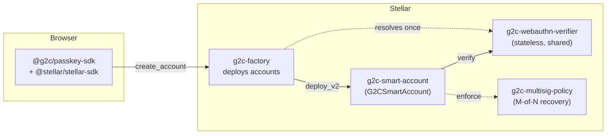
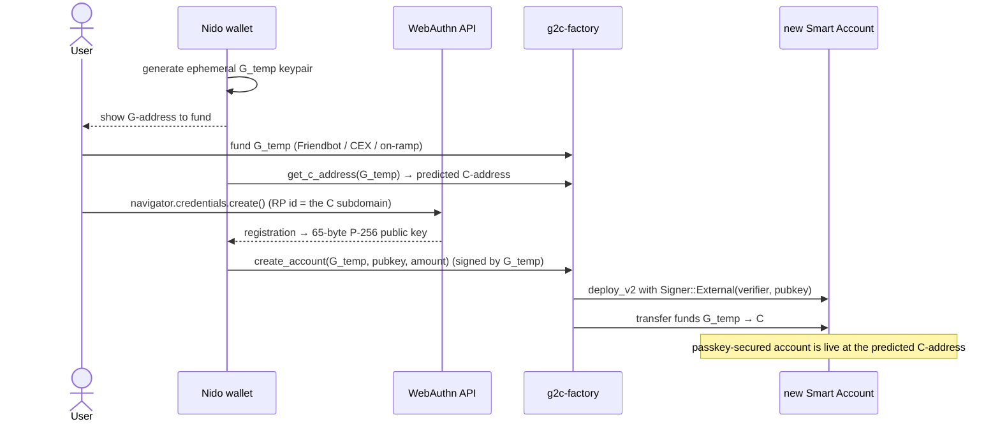

# How Nido Uses OpenZeppelin Smart Accounts

> **Series — Smart Accounts on Stellar, Part 2 of 5.**
> [Part 1](./01-stellar-smart-accounts-oz-standard.md) explained the standard —
> signers, context rules, policies, and the `do_check_auth` algorithm. This post
> shows how [Nido](https://nido.fyi) turns that standard into a working passkey
> wallet. If you haven't read Part 1, start there; this post assumes the model.

In Part 1 we made a promise: with OpenZeppelin's `stellar-accounts`, you build a
wallet by **composing** — write a verifier, add a context rule, attach a policy —
without ever touching the audited `do_check_auth` core. This post is the proof.

Nido (the project name in the repo is **g2c** — "G-address to C-address") is a
self-custodial Stellar wallet where your key *is* a passkey. No seed phrase. You
create an account with Face ID, and from then on every transaction is approved
with a biometric tap. Underneath, that's three small Soroban contracts and a
TypeScript SDK. The recurring theme you'll notice: **each contract is mostly a
one-line delegation to the library.** That's the design working as intended.

Everything here is from our repo on `stellar-accounts @ 637c53a` (soroban-sdk 26).

---

## The shape: three thin contracts



| Contract | What it is | Lines of *our* logic |
|----------|------------|----------------------|
| `g2c-webauthn-verifier` | OZ `Verifier` for secp256r1 passkeys. Stateless — deploy once, every account shares it. | ~50 |
| `g2c-smart-account` | OZ `SmartAccount` + `CustomAccountInterface` + `ExecutionEntryPoint`. The account itself. | ~170 |
| `g2c-factory` | Deploys a passkey-secured account at a deterministic address in one transaction. | the only "real" contract |
| `g2c-multisig-policy` | OZ `simple_threshold` wrapper for social recovery. | ~30 |

Let's read them.

---

## The WebAuthn verifier: a passkey becomes a signer

This is the whole contract — the piece that lets a P-256 passkey be a Soroban
signer. It implements the `Verifier` trait from Part 1 and delegates the actual
cryptography to the library's `webauthn` module:

```rust
// contracts/webauthn-verifier/src/contract.rs
#[contract]
pub struct WebAuthnVerifier;

#[contractimpl]
impl Verifier for WebAuthnVerifier {
    type KeyData = Bytes;  // 65-byte SEC1 pubkey (+ optional credential-id tail)
    type SigData = Bytes;  // XDR-encoded WebAuthnSigData

    fn verify(e: &Env, signature_payload: Bytes, key_data: Self::KeyData, sig_data: Self::SigData) -> bool {
        let sig_struct = WebAuthnSigData::from_xdr(e, &sig_data)
            .expect("WebAuthnSigData with correct format");
        let pub_key: BytesN<65> = extract_from_bytes(e, &key_data, 0..65)
            .expect("65-byte public key to be extracted");
        webauthn::verify(e, &signature_payload, &pub_key, &sig_struct)
    }

    // Strip the per-session credential-id tail so the same passkey always
    // canonicalizes to the same 65 bytes (required by OZ v0.7+ to detect
    // duplicate signer registrations).
    fn canonicalize_key(e: &Env, key_data: Self::KeyData) -> Bytes {
        webauthn::canonicalize_key(e, &key_data)
    }

    fn batch_canonicalize_key(e: &Env, key_data: Vec<Self::KeyData>) -> Vec<Bytes> {
        webauthn::batch_canonicalize_key(e, &key_data)
    }
}
```

`webauthn::verify` is where the standard does the work we previewed in Part 1: it
confirms the assertion type is `"webauthn.get"`, that the challenge equals
base64url(our digest), that the **User Present** and **User Verified** flags are
set, and finally that the secp256r1 signature is valid over
`sha256(authenticatorData ‖ sha256(clientDataJSON))`. Because the verifier holds
no state, we deploy exactly one instance and every Nido account points at it.

---

## The smart account: ~170 lines, almost all delegation

Here's the account contract's core. Note how the trait methods are each "require
the account's own auth, then call the library":

```rust
// contracts/smart-account/src/contract.rs
#[contract]
pub struct G2CSmartAccount;

#[contractimpl]
impl G2CSmartAccount {
    /// Seed the account with a single Default rule — typically the passkey
    /// signer, during the G→C migration. (A constructor is trusted, so it calls
    /// the library's add_context_rule directly, no require_auth.)
    pub fn __constructor(e: &Env, signers: Vec<Signer>, policies: Map<Address, Val>) {
        add_context_rule(e, &ContextRuleType::Default, &String::from_str(e, "default"), None, &signers, &policies);
    }
}

#[contractimpl]
impl CustomAccountInterface for G2CSmartAccount {
    type Error = SmartAccountError;
    type Signature = AuthPayload;   // the v0.7+ proof type from Part 1

    fn __check_auth(
        e: Env,
        signature_payload: Hash<32>,
        signatures: AuthPayload,
        auth_contexts: Vec<Context>,
    ) -> Result<(), Self::Error> {
        do_check_auth(&e, &signature_payload, &signatures, &auth_contexts)
    }
}
```

That's the entire authorization logic: **one line.** All the machinery from Part
1 — context-rule matching, digest binding, verifier calls, policy enforcement —
is `do_check_auth`. The rest of the contract is the `SmartAccount` trait methods
(`add_signer`, `add_context_rule`, …), each guarded by the account's own auth:

```rust
// contracts/smart-account/src/contract.rs (representative)
fn add_signer(e: &Env, context_rule_id: u32, signer: Signer) -> u32 {
    e.current_contract_address().require_auth();   // only the account authorizes its own changes
    add_signer(e, context_rule_id, &signer)
}
```

The library functions deliberately *don't* check authorization — that's the
contract's job — so this pattern (`require_auth()` then delegate) is exactly what
OpenZeppelin intends. And because the guard is `current_contract_address()`,
mutating signers/rules has to go through `__check_auth` itself: **your passkey
governs your own key management.**

Two more methods are worth seeing. First, the execution entry point — a generic
"call any contract as me," which is how a Nido account moves funds or talks to a
dApp:

```rust
// contracts/smart-account/src/contract.rs
impl ExecutionEntryPoint for G2CSmartAccount {
    fn execute(e: &Env, target: Address, target_fn: Symbol, target_args: Vec<Val>) {
        e.current_contract_address().require_auth();
        e.invoke_contract::<Val>(&target, &target_fn, target_args);
    }
}
```

Second, a typed convenience wrapper for installing social recovery — we'll come
back to it, but notice it's just `add_context_rule` with the scope and policy map
pre-assembled:

```rust
// contracts/smart-account/src/contract.rs
pub fn add_multisig_recovery(
    e: &Env, name: String, valid_until: Option<u32>,
    friends: Vec<Signer>, multisig_policy: Address, threshold: u32,
) -> ContextRule {
    e.current_contract_address().require_auth();
    let install: Val = SimpleThresholdAccountParams { threshold }.into_val(e);
    let mut policies: Map<Address, Val> = Map::new(e);
    policies.set(multisig_policy, install);
    add_context_rule(
        e,
        &ContextRuleType::CallContract(e.current_contract_address()), // scoped to SELF
        &name, valid_until, &friends, &policies,
    )
}
```

---

## The factory: a passkey account in one transaction

The factory is the only contract with genuine orchestration logic, and its job is
the magic moment of onboarding: **fund an account and deploy it, atomically.**

```rust
// contracts/factory/src/contract.rs
pub fn create_account(e: &Env, funder: &Address, key: BytesN<65>, amount: &i128) -> Address {
    funder.require_auth();
    let new_account = Self::deploy_account_contract(e, funder, key.to_bytes());
    let xlm_sac = xlm::stellar_asset_client(e);
    xlm_sac.transfer(funder, &new_account, amount);   // move funds G → C in the same tx
    new_account
}

fn deploy_account_contract(e: &Env, funder: &Address, key: Bytes) -> Address {
    let verifier_addr = Self::resolve(e, "verifier");        // shared verifier, resolved once & cached
    let signer = Signer::External(verifier_addr, key);       // <-- the passkey, as an External signer
    let signers = soroban_sdk::vec![e, signer];
    let policies = soroban_sdk::Map::new(e);
    Self::deployer(e, funder).deploy_v2(Self::account_wasm_hash(e), (&signers, &policies))
}
```

Three things make this nice:

**1. The passkey is wired in at birth.** The factory wraps the 65-byte public key
in `Signer::External(verifier, key)` and passes it straight to the account's
constructor, which seeds a `Default` rule with it. The user owns the account from
the very first ledger.

**2. The address is deterministic — you know it *before* you deploy.** The
deployer salts on the funder address with a fixed zero salt, so each funder maps
to exactly one C-address, and you can compute it in advance:

```rust
// contracts/factory/src/contract.rs
pub fn get_c_address(e: &Env, funder: &Address) -> Address {
    Self::deployer(e, funder).deployed_address()
}

fn deployer(e: &Env, funder: &Address) -> DeployerWithAddress {
    e.deployer().with_address(funder.clone(), BytesN::from_array(e, &[0; 32]))
}
```

The wallet calls `get_c_address(funder)`, shows the user their future address, can
even let funds arrive there first, then deploys.

**3. No hand-maintained WASM hash.** The factory embeds the smart-account WASM at
build time and hashes it on demand (caching the result), so `deploy_v2` always
targets exactly the bytes the factory was built with:

```rust
// contracts/factory/src/contract.rs
mod smart_account {
    pub const WASM: &[u8] = include_bytes!(env!("STELLAR_ACCOUNT_WASM")); // staged by build.rs
}

fn compute_account_wasm_hash(e: &Env) -> BytesN<32> {
    e.crypto().sha256(&Bytes::from_slice(e, smart_account::WASM)).to_bytes()
}
```

### The onboarding flow, end to end



One transaction: deploy the account, install the passkey, migrate the funds. The
ephemeral G-key has done its job and can be discarded — from here on, the passkey
is the account.

---

## The browser side: a Face ID tap → a Soroban `AuthPayload`

The contracts are half the story. The other half is `@g2c/passkey-sdk`, which
translates between the WebAuthn world (DER signatures, `clientDataJSON`,
attestation objects) and the Soroban world (`AuthPayload`, `Signer::External`,
XDR). Two flows: registration and signing.

### Registration — extract the public key

`navigator.credentials.create()` returns an attestation. We pull the 65-byte
uncompressed P-256 key out of it — that's the `key` the factory wants:

```ts
// packages/passkey-sdk/src/webauthn.ts
export function extractPublicKey(response: WebAuthnAttestationResponse): Uint8Array {
  const publicKeyDer = response.getPublicKey();
  if (!publicKeyDer) throw new Error("No public key in attestation response");
  const spki = new Uint8Array(publicKeyDer);
  // SPKI for P-256 uncompressed: the last 65 bytes are 04 || x(32) || y(32)
  const rawKey = spki.slice(-65);
  if (rawKey[0] !== 0x04) throw new Error("Expected uncompressed P-256 key (0x04 prefix)");
  return rawKey;
}
```

(There's a CBOR fallback for mobile WebViews where `getPublicKey()` isn't
available — same 65-byte result, parsed out of the attestation object.)

### Signing — the subtle part

To authorize a transaction, the user signs with `navigator.credentials.get()`.
But **what** do they sign? Recall Part 1, step 3: signers sign the *auth digest*,
`sha256(signature_payload ‖ context_rule_ids.to_xdr())`, **not** the host's raw
payload.
Get this wrong and `do_check_auth` rejects you. The SDK makes it explicit:

```ts
// Illustrative end-to-end use of the SDK helpers (auth.ts, signature.ts)
import { buildAuthHash, computeAuthDigest, parseAssertionResponse, injectPasskeySignature } from "@g2c/passkey-sdk";

// 1. The host payload for this auth entry (from simulation).
const payload = buildAuthHash(authEntry, networkPassphrase, lastLedger);

// 2. What the passkey must actually sign: bind the rule selection. [0] = Default rule.
const challenge = computeAuthDigest(payload, [0]);

// 3. The biometric ceremony — challenge is the auth digest, not the raw payload.
const assertion = await navigator.credentials.get({
  publicKey: { challenge, /* allowCredentials, rpId, userVerification: "required" */ },
});

// 4. Parse + normalize the signature (DER → 64-byte r‖s, low-S for Stellar).
const passkeySig = parseAssertionResponse(assertion.response);

// 5. Build the AuthPayload and splice it into the transaction's auth entry.
injectPasskeySignature(transaction, passkeySig, verifierAddress, publicKey, lastLedger, undefined, [0]);
```

Step 2 is the one people miss. `computeAuthDigest` mirrors the Rust exactly:

```ts
// packages/passkey-sdk/src/auth.ts
export function computeAuthDigest(signaturePayload: Uint8Array, contextRuleIds: readonly number[] = [0]): Buffer {
  const ctxIdsXdr = xdr.ScVal.scvVec(contextRuleIds.map((id) => xdr.ScVal.scvU32(id))).toXDR();
  const preimage = Buffer.concat([Buffer.from(signaturePayload), ctxIdsXdr]);
  return hash(preimage);   // sha256(payload || context_rule_ids.to_xdr())
}
```

Step 4 hides a Stellar gotcha: WebAuthn hands you an **ASN.1 DER** signature, but
Stellar wants a 64-byte compact `r ‖ s` with a **low-S** value. `derToCompact`
does both:

```ts
// packages/passkey-sdk/src/signature.ts (the low-S step)
let sBigInt = bufToBigInt(s);
const compact = new Uint8Array(64);
compact.set(r, 0);
if (sBigInt > P256_N_HALF) {       // high-S? flip it to low-S
  sBigInt = P256_N - sBigInt;
  compact.set(bigIntToBuf32(sBigInt), 32);
} else {
  compact.set(s, 32);
}
```

And step 5 — `injectPasskeySignature` — is where the TypeScript meets the Rust
types from Part 1. It hand-builds the `AuthPayload` as XDR: a `Signer::External`
variant (`Vec[Symbol("External"), Address, Bytes]`), a `WebAuthnSigData` map, and
the `context_rule_ids`:

```ts
// packages/passkey-sdk/src/auth.ts (the AuthPayload construction, trimmed)
// Signer::External(verifier, public_key)
const signerScVal = xdr.ScVal.scvVec([
  xdr.ScVal.scvSymbol("External"),
  Address.fromString(verifierAddress).toScVal(),
  xdr.ScVal.scvBytes(Buffer.from(publicKey)),
]);

// signers: Map<Signer, Bytes>  — our one passkey → its WebAuthnSigData bytes
const signersMap = xdr.ScVal.scvMap([new xdr.ScMapEntry({ key: signerScVal, val: xdr.ScVal.scvBytes(sigDataBytes) })]);

// AuthPayload { context_rule_ids, signers } — Symbol keys in alphabetical order
creds.signature(xdr.ScVal.scvMap([
  new xdr.ScMapEntry({ key: xdr.ScVal.scvSymbol("context_rule_ids"), val: contextRuleIdsVec }),
  new xdr.ScMapEntry({ key: xdr.ScVal.scvSymbol("signers"),          val: signersMap }),
]));
```

If you squint, that's the exact `AuthPayload { signers, context_rule_ids }` struct
from Part 1, serialized by hand because we're constructing it outside a generated
binding. The smart account's `__check_auth` deserializes it right back.

---

## Testing passkey auth without a browser

Here's a thing that surprised us in the best way: because the verifier is just a
contract and a passkey signature is just secp256r1, **you can unit-test the entire
passkey auth path with synthetic keys and no browser at all.** Our integration
tests generate a P-256 keypair and assemble a real WebAuthn assertion by hand:

```rust
// crates/integration-tests/src/lib.rs (trimmed)
pub fn build_contract_assertion(signing_key: &SigningKey, env: &Env, signature_payload: &[u8; 32]) -> ContractAssertion {
    // challenge = base64url(signature_payload)
    let challenge_b64 = URL_SAFE_NO_PAD.encode(signature_payload);

    // authenticatorData: 37 bytes; flags = UP|UV|BE|BS = 0x1D
    let mut auth_data_raw = [0u8; 37];
    auth_data_raw[32] = 0x1D;
    let authenticator_data = Bytes::from_array(env, &auth_data_raw);

    // clientDataJSON with the challenge embedded
    let client_data_str = format!(
        r#"{{"type":"webauthn.get","challenge":"{challenge_b64}","origin":"https://example.com","crossOrigin":false}}"#);
    let client_data = Bytes::from_slice(env, client_data_str.as_bytes());

    // message digest = SHA-256(authData || SHA-256(clientData)) — then prehash-sign it, low-S
    let client_data_hash = env.crypto().sha256(&client_data);
    let mut msg = authenticator_data.clone();
    msg.extend_from_array(&client_data_hash.to_array());
    let digest = env.crypto().sha256(&msg);
    let sig = signing_key.sign_prehash(&digest.to_array()).unwrap();
    let sig = sig.normalize_s().unwrap_or(sig);
    // ... pack into BytesN<64>, take SEC1 pubkey ...
}
```

That mirrors, byte for byte, what the browser produces — and what the verifier
expects. With it, the full `__check_auth` round-trip is a plain `cargo test`:

```rust
// crates/integration-tests/tests/it/smart_account_auth.rs (trimmed)
#[test]
fn smart_account_check_auth_with_passkey() {
    let env = Env::default();
    let (_client, account_addr, verifier_addr, signing_key) = deploy_smart_account(&env);

    let hash = env.crypto().sha256(&Bytes::from_array(&env, &[0xCD; 32]));

    // v0.7+: sign the digest that binds context_rule_ids (Default rule = 0).
    let context_rule_ids = vec![&env, 0u32];
    let auth_digest = compute_auth_digest(&env, &hash, &context_rule_ids);
    let assertion = build_contract_assertion(&signing_key, &env, &auth_digest);

    let sig_data = WebAuthnSigData { signature: assertion.signature, authenticator_data: assertion.authenticator_data, client_data: assertion.client_data };
    let signer = Signer::External(verifier_addr, /* 65-byte pubkey */ key_data);

    let mut sig_map: Map<Signer, Bytes> = Map::new(&env);
    sig_map.set(signer, sig_data.to_xdr(&env));
    let signatures = AuthPayload { signers: sig_map, context_rule_ids };

    let context = Context::Contract(ContractContext { contract: Address::generate(&env), fn_name: symbol_short!("transfer"), args: vec![&env] });

    env.as_contract(&account_addr, || {
        do_check_auth(&env, &hash, &signatures, &vec![&env, context]).unwrap();   // ✅
    });
}
```

There's a sibling test that signs with the *wrong* key and asserts
`do_check_auth` rejects it. If you're building on `stellar-accounts`, this pattern
— `deploy_smart_account` + `build_contract_assertion` + `do_check_auth` — is the
fastest way to gain confidence in your auth wiring.

---

## Scoped session keys, for real

Part 1 claimed you get session keys "for free" by adding a context rule. Here's
that claim cashed out. Add a rule scoped to one target contract, with a session
signer:

```rust
// crates/integration-tests/tests/it/scoped_session_key.rs (trimmed)
client.add_context_rule(
    &ContextRuleType::CallContract(target.clone()),   // only this contract
    &String::from_str(&env, "session"),
    &None,                                             // or Some(ledger) to expire it
    &vec![&env, session_signer],
    &Map::new(&env),
);
```

Now sign with that session key against rule id `1` and the in-scope call passes,
while the out-of-scope call is rejected — enforced entirely by `do_check_auth`:

```rust
// in-scope: authorizing a call to `target` → OK
do_check_auth(&env, &hash, &sigs, &vec![&env, context_for(&env, &target)]).unwrap();

// out-of-scope: same key, but authorizing a call to `other` → rejected
let result = catch_unwind(|| { /* ... */
    do_check_auth(&env, &hash, &sigs, &vec![&env, context_for(&env, &other)]).unwrap();
});
assert!(result.is_err());
```

Our test suite also covers the **expiry** path (set `valid_until`, advance the
ledger past it, watch it stop working) and the **revoke** path (`remove_context_rule`
and the key is dead). All four behaviors — scope, expiry, revocation, wrong-target
— are properties of the standard's `ContextRule`, not code we had to write.

---

## Social recovery: friends who can rebuild you, but can't rob you

The last piece is the scariest to get wrong, and it's where the layered model
really pays off. Recovery means: if you lose your passkey, some quorum of trusted
friends can add a *new* signer to your account. The danger is obvious — those
friends must be able to fix your keys **without** being able to move your money.

The standard expresses that precisely. `add_multisig_recovery` (shown earlier)
installs a rule that is:

- **scoped to `CallContract(self)`** — it can only authorize calls *to your own
  account's methods* (`add_signer`, `add_context_rule`, …), never a token
  transfer to a third party;
- **gated by a threshold policy** — M of your N friends must sign.

The policy itself is another ~30-line wrapper around the library's
`simple_threshold`:

```rust
// contracts/multisig-policy/src/contract.rs
#[contractimpl]
impl Policy for MultisigPolicy {
    type AccountParams = SimpleThresholdAccountParams;

    fn enforce(e: &Env, context: Context, authenticated_signers: Vec<Signer>, context_rule: ContextRule, smart_account: Address) {
        simple_threshold::enforce(e, &context, &authenticated_signers, &context_rule, &smart_account);
    }
    fn install(e: &Env, install_params: Self::AccountParams, context_rule: ContextRule, smart_account: Address) {
        simple_threshold::install(e, &install_params, &context_rule, &smart_account);
    }
    fn uninstall(e: &Env, context_rule: ContextRule, smart_account: Address) {
        simple_threshold::uninstall(e, &context_rule, &smart_account);
    }
}
```

Our integration tests prove the boundary holds: two friend signatures authorize a
call to the recovering account, but the **same two signatures are rejected for any
other contract** — the `CallContract(self)` scope sees to that.

One subtlety worth flagging for builders, because it bit us: friends are
`Signer::Delegated` (their own accounts), and a delegated signer authorizes
through a **nested** Soroban auth entry. That nested entry must target the
*recovering* account's `__check_auth` and authorize the *parent* digest — and the
digest must be byte-identical across the originator, each friend, and the chain.
The trap is relative expiration ledgers diverging between parties; the SDK's
`buildAuthHashAt` takes an **absolute** expiration ledger precisely so everyone
hashes the same preimage. (Recovery gets its own full post — it's Part 5.)

---

## Try it / where the code lives

- **Contracts:** `contracts/{smart-account,webauthn-verifier,factory,multisig-policy}/`
- **Browser SDK:** `packages/passkey-sdk/` (`webauthn.ts`, `signature.ts`, `auth.ts`)
- **Browserless tests:** `crates/integration-tests/` — run a single one with
  `cargo test -p g2c-integration-tests smart_account_check_auth_with_passkey`
- **Build & test:** `just build-contracts && just test`
- **Live testnet addresses:** see [`DEPLOYED.md`](../../DEPLOYED.md) (factory,
  verifier, and multisig-policy are deployed and resolved via the Stellar
  Registry).
- **A working dApp integration:** `examples/status-message-dapp/` shows a
  third-party app letting users sign in with Nido.

The thing to take away: across four contracts, the amount of *security-critical
auth code we wrote* rounds to zero. `do_check_auth` is OpenZeppelin's; our job was
to pick a verifier (passkeys), seed a rule (the default passkey), and add a policy
(threshold recovery). That's the standard doing exactly what a standard should.

---

## Next in the series

- [**Part 3 — Passkeys & on-chain WebAuthn**](./03-passkeys-and-on-chain-webauthn.md):
  every byte of the assertion, the secp256r1 digest, the flags, and why
  verification is trustless.
- **Part 4 — Scoped sessions & policies:** building custom policies (spending
  limits, allow-lists) and composing them.
- **Part 5 — Social recovery:** the delegated-friend nested-auth dance, in full.

See the [series index](./README.md) for the roadmap.
