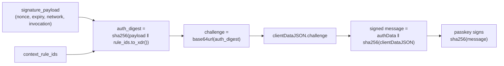

# Passkeys & On-Chain WebAuthn: a Byte-by-Byte Deep Dive

> **Series — Smart Accounts on Stellar, Part 3 of 5.**
> [Part 1](./01-stellar-smart-accounts-oz-standard.md) explained the OpenZeppelin
> smart-account standard; [Part 2](./02-how-g2c-uses-oz-smart-accounts.md) showed
> how [Nido](https://nido.fyi) wires a passkey in as a `Signer::External`. This
> post zooms all the way in on that one signer: **how a browser passkey becomes a
> signature a Soroban contract can verify — without trusting anyone.** See the
> [series index](./README.md) for the roadmap.

In Part 2 we waved at the WebAuthn verifier and promised to "dissect every byte
later." This is later.

Here's the thing worth slowing down for. When a Nido user taps Face ID, a private
key that **has never left their phone's secure enclave** produces a signature, and
~5 seconds later a Soroban contract on a public network has independently decided
that signature is valid — with no backend, no oracle, and no one to trust except
math and a 65-byte public key. That's a genuinely remarkable little pipeline, and
once you see each stage you'll know exactly why it's safe.

We'll follow one assertion from the enclave to `secp256r1_verify`, byte by byte.
All code is from our repo on `stellar-accounts @ 637c53a` (soroban-sdk 26); the
on-chain verification logic lives in the library's `verifiers/webauthn.rs`.

---

## What a passkey actually is

A **passkey** is a WebAuthn/FIDO2 credential: a public/private keypair generated
and stored by an *authenticator* — your phone's Secure Enclave, a laptop's TPM, or
a hardware key like a YubiKey. The defining property is that **the private key is
non-extractable**: the OS will let you *use* it (gated behind Face ID / Touch ID /
PIN) but never *read* it. There's nothing to phish, paste, screenshot, or write on
a recovery card.

For our purposes the important specifics:

- **The curve is P-256** (a.k.a. secp256r1, a.k.a. prime256v1). WebAuthn's default
  signing algorithm is **ES256** = ECDSA over P-256 with SHA-256 (COSE algorithm
  id `-7`). This is *not* Stellar's native ed25519 — which is the entire reason we
  need a custom verifier contract.
- **Two ceremonies.** `navigator.credentials.create()` (registration) mints the
  keypair and hands you the **public key**. `navigator.credentials.get()`
  (assertion) signs a challenge you supply. Nido uses the first once, at account
  creation, and the second for every transaction.

Why does P-256 work on-chain at all? Because Soroban's host exposes a **native
`secp256r1_verify`** function. P-256 verification is famously expensive in pure
Wasm, but as a host primitive it's cheap and constant-cost — so a passkey
signature is a practical thing to check inside a contract. Stellar's runtime
quietly did the hard part for us.

---

## The format impedance mismatch

There's a catch that trips up everyone the first time: **WebAuthn and Stellar
describe the same elliptic-curve math in completely different byte formats.**

| | WebAuthn / browser gives you | Stellar / Soroban wants |
|---|---|---|
| Public key | SPKI DER, or a COSE key map | raw 65-byte SEC1 (`0x04 ‖ x ‖ y`) |
| Signature | ASN.1 DER (`SEQUENCE { r, s }`) | 64-byte compact (`r ‖ s`), **low-S** |

So the SDK is, more than anything, a **translator**. Two directions: pull a clean
65-byte key out of registration, and pull a clean 64-byte signature out of each
assertion. Let's do both.

---

## Registration: extracting the 65-byte public key

Registration calls `navigator.credentials.create()` with P-256 requested
explicitly (`alg: -7`). The browser returns an attestation whose `getPublicKey()`
gives an **SPKI**-encoded key. For an uncompressed P-256 point, the meaningful
part is the trailing 65 bytes — `0x04` followed by the 32-byte X and 32-byte Y
coordinates:

```ts
// packages/passkey-sdk/src/webauthn.ts
export function extractPublicKey(response: WebAuthnAttestationResponse): Uint8Array {
  const publicKeyDer = response.getPublicKey();
  if (!publicKeyDer) throw new Error("No public key in attestation response");
  const spki = new Uint8Array(publicKeyDer);
  // SPKI for P-256 uncompressed: the last 65 bytes are 04 || x(32) || y(32)
  const rawKey = spki.slice(-65);
  if (rawKey[0] !== 0x04) throw new Error("Expected uncompressed P-256 key (0x04 prefix)");
  return rawKey;
}
```

Not every environment cooperates, though. Some mobile WebViews (Capacitor, older
in-app browsers) don't implement `getPublicKey()`. There, we fall back to parsing
the raw `attestationObject`: it's CBOR, containing `authData`, which contains the
**COSE key** — another map, where key `-2` is the X coordinate and `-3` is Y. The
SDK ships a minimal CBOR reader just for this, and reassembles the same
`0x04 ‖ x ‖ y`:

```ts
// packages/passkey-sdk/src/webauthn.ts (COSE → SEC1, trimmed)
if (keyVal === -2) x = bytes;        // COSE EC2 x-coordinate
else if (keyVal === -3) y = bytes;   // COSE EC2 y-coordinate
// ...
const publicKey = new Uint8Array(65);
publicKey[0] = 0x04;
publicKey.set(x, 1);
publicKey.set(y, 33);
return publicKey;
```

Two paths, one result: **65 bytes.** That's the value Part 2's factory wraps as
`Signer::External(verifier, key)` and stores in the account's `Default` rule. From
this moment, those 65 bytes *are* the user's identity on-chain.

---

## The assertion: what actually gets signed

Now the interesting half. To authorize a transaction, the wallet calls
`navigator.credentials.get({ publicKey: { challenge, ... } })`. The authenticator
returns three blobs — `authenticatorData`, `clientDataJSON`, and a `signature` —
and the central question is: **what message did the private key actually sign?**

The WebAuthn answer:

```
signed message = authenticatorData ‖ SHA-256(clientDataJSON)
```

and the ECDSA signature is over `SHA-256(signed message)`. Unpack those two
operands, because every security property lives in them.

### `authenticatorData` — 37 bytes of authenticator state

```
 offset  size  field
 ------  ----  -----------------------------------------------
   0      32   rpIdHash    SHA-256 of the Relying Party ID
  32       1   flags       bit field (see below)
  33       4   signCount   big-endian counter
  37     var   (optional)  attested credential data / extensions
                           — absent in a typical webauthn.get assertion
```

The `flags` byte at offset 32 is the part that matters on-chain:

| Bit | Mask | Name | Meaning |
|-----|------|------|---------|
| 0 | `0x01` | **UP** | User Present — someone physically touched/triggered the authenticator |
| 2 | `0x04` | **UV** | User Verified — *and* passed biometric / PIN |
| 3 | `0x08` | BE | Backup Eligible — the credential *can* sync (e.g. iCloud Keychain) |
| 4 | `0x10` | BS | Backup State — the credential *is* currently backed up |
| 6 | `0x40` | AT | Attested credential data present |
| 7 | `0x80` | ED | Extension data present |

Nido cares most about **UP** and **UV**: together they're cryptographic proof that
a human was present and verified themselves with biometrics, baked into the signed
bytes. You can't lift a UV signature off a malware-driven background request.

### `clientDataJSON` — where the binding happens

This is a small JSON object the browser builds and the authenticator signs over:

```json
{ "type": "webauthn.get", "challenge": "<base64url>", "origin": "https://…", "crossOrigin": false }
```

The `challenge` field is the entire point of the exercise. **Whatever you put in
the challenge is what the signature is bound to** — because `clientDataJSON` is
part of the signed message. And here's the connection back to Part 1:

> Nido's challenge is the **auth digest**:
> `challenge = base64url( sha256(signature_payload ‖ context_rule_ids.to_xdr()) )`

That's not an arbitrary nonce — it's the exact digest the smart account's
`do_check_auth` will reconstruct and demand a signature over (Part 1, step 3). The
`signature_payload` itself binds the Soroban nonce, the signature-expiration
ledger, the network, and the full invocation tree. So the passkey signature is
welded to **one specific operation, on one network, valid for one window, under
one context rule.** Replay it anywhere else and the recomputed challenge won't
match. The SDK makes the binding explicit:

```ts
// packages/passkey-sdk/src/auth.ts
export function computeAuthDigest(signaturePayload: Uint8Array, contextRuleIds: readonly number[] = [0]): Buffer {
  const ctxIdsXdr = xdr.ScVal.scvVec(contextRuleIds.map((id) => xdr.ScVal.scvU32(id))).toXDR();
  const preimage = Buffer.concat([Buffer.from(signaturePayload), ctxIdsXdr]);
  return hash(preimage);   // sha256(payload || context_rule_ids.to_xdr())
}
// ...this Buffer is what we pass as `challenge` to navigator.credentials.get()
```



### The DER → compact, low-S detour

The signature the authenticator hands back is **ASN.1 DER** — a `SEQUENCE` of two
big integers `r` and `s`, with variable-length encoding and the occasional leading
zero byte. Stellar wants a fixed **64-byte `r ‖ s`**, and it rejects **high-S**
signatures outright (ECDSA is malleable: `(r, s)` and `(r, n − s)` are both valid,
so Stellar canonicalizes to the low half to avoid duplicate-signature ambiguity).
`derToCompact` parses the DER and folds high-S down:

```ts
// packages/passkey-sdk/src/signature.ts (the low-S step)
let sBigInt = bufToBigInt(s);
const compact = new Uint8Array(64);
compact.set(r, 0);
if (sBigInt > P256_N_HALF) {       // high-S? reflect it to the low half
  sBigInt = P256_N - sBigInt;
  compact.set(bigIntToBuf32(sBigInt), 32);
} else {
  compact.set(s, 32);
}
```

Skip this and verification fails intermittently — about half your signatures come
back high-S — which is a maddening bug to chase if you don't know to look for it.

### Packaging for the contract

The three components get bundled into the contract type the verifier expects,
`WebAuthnSigData`, and XDR-encoded. Recall its shape from the library:

```rust
// stellar-accounts: verifiers/webauthn.rs
pub struct WebAuthnSigData {
    pub signature: BytesN<64>,        // compact, low-S
    pub authenticator_data: Bytes,    // the 37+ bytes above
    pub client_data: Bytes,           // the raw clientDataJSON
}
```

Part 2 covered `parseAssertionResponse` (which runs `derToCompact` for you) and
`injectPasskeySignature` (which builds the full `AuthPayload`), so we won't repeat
them. The takeaway: everything the contract needs to *redo the whole computation*
is now on its way on-chain — the data, and the signature over it.

---

## On-chain: the verifier, step by step

Nido's verifier contract is deliberately tiny — it unwraps the XDR and the 65-byte
key, then hands off to the library:

```rust
// contracts/webauthn-verifier/src/contract.rs
fn verify(e: &Env, signature_payload: Bytes, key_data: Self::KeyData, sig_data: Self::SigData) -> bool {
    let sig_struct = WebAuthnSigData::from_xdr(e, &sig_data).expect("WebAuthnSigData with correct format");
    let pub_key: BytesN<65> = extract_from_bytes(e, &key_data, 0..65).expect("65-byte public key to be extracted");
    webauthn::verify(e, &signature_payload, &pub_key, &sig_struct)
}
```

Remember `signature_payload` here is the **auth digest** that `do_check_auth`
passed in (Part 1's `authenticate` calls `verifier.verify(&auth_digest, …)`). Now
the real work, in `webauthn::verify` — this is the whole security argument in ~30
lines:

```rust
// stellar-accounts: verifiers/webauthn.rs (verify(), trimmed)
let WebAuthnSigData { signature, authenticator_data, client_data } = sig_data;

// (a) bound the client data, then parse it — in no_std, with serde_json_core.
if client_data.len() > CLIENT_DATA_MAX_LEN as u32 { panic_with_error!(e, WebAuthnError::ClientDataTooLong) }
let client_data_json = client_data.to_buffer::<CLIENT_DATA_MAX_LEN>();
let (client_data_json, _): (ClientDataJson, _) =
    serde_json_core::de::from_slice(client_data_json.as_slice())
        .unwrap_or_else(|_| panic_with_error!(e, WebAuthnError::JsonParseError));

// (b) type must be "webauthn.get", and the challenge must equal OUR digest.
validate_expected_type(e, &client_data_json);
validate_challenge(e, &client_data_json, signature_payload);

// (c) authenticator data must be well-formed; check the human-presence flags.
if authenticator_data.len() < AUTHENTICATOR_DATA_MIN_LEN as u32 { panic_with_error!(e, WebAuthnError::AuthDataFormatInvalid) }
let flags = authenticator_data.get(32).expect("32 byte to be present");
validate_user_present_bit_set(e, flags);
validate_user_verified_bit_set(e, flags);
validate_backup_eligibility_and_state(e, flags);

// (d) reconstruct the signed message and verify the secp256r1 signature.
let client_data_hash = e.crypto().sha256(client_data);
let mut message_digest = authenticator_data.clone();
message_digest.extend_from_array(&client_data_hash.to_array());
e.crypto().secp256r1_verify(pub_key, &e.crypto().sha256(&message_digest), signature);
true
```

Trace it against everything above:

- **(a)** The client data is capped at **1024 bytes** and parsed with
  `serde_json_core` — yes, JSON parsing inside a `no_std` Wasm contract.
- **(b)** `validate_expected_type` rejects anything that isn't `"webauthn.get"`
  (so a *registration* assertion can't be replayed as a signing one). Then
  `validate_challenge` recomputes the expected challenge from the payload and
  compares — this is the binding being checked:

  ```rust
  // stellar-accounts: verifiers/webauthn.rs
  pub fn validate_challenge(e: &Env, client_data_json: &ClientDataJson, signature_payload: &Bytes) {
      let signature_payload: BytesN<32> = extract_from_bytes(e, signature_payload, 0..32)
          .unwrap_or_else(|| panic_with_error!(e, WebAuthnError::SignaturePayloadInvalid));
      let mut expected_challenge = [0u8; 43];                       // 32 bytes → 43 base64url chars
      base64_url_encode(&mut expected_challenge, &signature_payload.to_array());
      if client_data_json.challenge.as_bytes() != expected_challenge {
          panic_with_error!(e, WebAuthnError::ChallengeInvalid)
      }
  }
  ```

- **(c)** `authenticatorData` must be at least **37 bytes**, **UP** and **UV** must
  be set, and the **BE/BS** relationship must be valid (you can't be "backed up"
  without being "backup eligible").
- **(d)** The contract **rebuilds the signed message itself** —
  `authenticatorData ‖ sha256(clientDataJSON)` — and verifies the signature over
  its SHA-256 with `secp256r1_verify`. It never takes the client's word for the
  digest; it derives it.

```mermaid
sequenceDiagram
    participant SA as Smart Account (do_check_auth)
    participant V as WebAuthn Verifier
    participant H as Soroban host crypto

    SA->>V: verify(auth_digest, pubkey(65), WebAuthnSigData)
    V->>V: client_data ≤ 1024B, parse JSON
    V->>V: type == "webauthn.get"?
    V->>V: challenge == base64url(auth_digest)?  ← the binding
    V->>V: authData ≥ 37B; UP & UV flags set?
    V->>H: sha256(authData ‖ sha256(clientData))
    V->>H: secp256r1_verify(pubkey, digest, signature)
    H-->>V: ok / panic
    V-->>SA: true
```

---

## Why this is trustless

Step back and look at the inputs the contract relied on. The `authenticatorData`,
the `clientDataJSON`, and the `signature` **all came from the (untrusted)
submitter.** The contract trusted exactly **one** thing: the 65-byte public key it
read from its own storage — the key the user registered at account creation.

Everything else is *recomputed and checked*:

- the challenge is recomputed from the on-chain payload and compared, so the
  submitter can't claim the signature authorizes a different operation;
- the signed message is rebuilt from the supplied bytes, so the submitter can't
  feed a digest that doesn't correspond to the data they provided;
- the signature is verified against the stored public key, so only the holder of
  the non-extractable private key could have produced it.

There is **no off-chain validation step to bypass, no backend that could be
compromised, and no signature that can be replayed** — the binding to nonce,
expiration, network, and context rule (Part 1) sees to the last one. A malicious
RPC node or a hostile dApp can mangle, drop, or replay the transaction all it
likes; it cannot forge a passkey signature for your account. That property — *the
chain itself is the verifier* — is the whole reason Nido needs no custodial server.

---

## What OpenZeppelin deliberately skips (and why)

A WebAuthn purist will notice the verifier does **not** do several things the W3C
ceremony lists. This is intentional, and the library documents each omission:

- **Origin check.** The verifier doesn't validate `clientDataJSON.origin`. On the
  web, origin-checking stops a phishing site from using your credential — but
  on-chain there's no "origin" to a transaction. Nido instead leans on **WebAuthn's
  own RP-ID scoping**: each account's passkey is registered to its
  `<contractId>` subdomain (see [ARCHITECTURE.md](../../ARCHITECTURE.md)), so the
  browser refuses to use it on any other site at the protocol level.
- **`rpIdHash` check.** Same reasoning — the 32 leading bytes of `authData` aren't
  compared to an expected RP. Platform/browser enforcement and the subdomain
  isolation cover it.
- **Signature counter.** WebAuthn's monotonic counter detects cloned
  authenticators; on-chain we already have **nonce-based replay protection**, which
  makes it redundant (and many platform authenticators report `0` anyway).
- **Attestation.** We verify *authentication* (`webauthn.get`), not the
  registration attestation statement, so we don't reason about which authenticator
  model minted the key.

The honest trade-off: this design **moves origin/RP enforcement to registration
time and to the frontend's subdomain isolation**, rather than re-checking it in the
contract. For a wallet where each account is pinned to its own subdomain, that's a
sound boundary — but it's worth understanding *where* the protection lives, rather
than assuming the contract re-derives it.

### One more: `canonicalize_key`

Because WebAuthn key data can carry a per-session credential-ID tail after the 65
key bytes, the verifier's `canonicalize_key` strips it back down to the 65 bytes:

```rust
// stellar-accounts: verifiers/webauthn.rs
pub fn canonicalize_key(e: &Env, key_data: &Bytes) -> Bytes {
    let pub_key: BytesN<65> = extract_from_bytes(e, key_data, 0..65)
        .unwrap_or_else(|| panic_with_error!(e, WebAuthnError::KeyDataInvalid));
    Bytes::from_slice(e, &pub_key.to_array())
}
```

This is what lets the smart account recognize "the same passkey, registered twice"
as a duplicate — important so nobody sneaks the same key into an N-of-M rule twice
to cheat a threshold (Part 1, Layer 1).

---

## Prove it to yourself — no browser required

The clearest way to confirm you understand the byte layout is to build an assertion
*by hand* and watch the real verifier accept it. Our integration tests do exactly
that with a synthetic P-256 key — and you can read the whole format off the code:

```rust
// crates/integration-tests/src/lib.rs (trimmed)
// Challenge = base64url(signature_payload)   — the test passes the auth digest as signature_payload
let challenge_b64 = URL_SAFE_NO_PAD.encode(signature_payload);

// authenticatorData: 37 bytes; flags byte = UP|UV|BE|BS = 0x1D
let mut auth_data_raw = [0u8; 37];
auth_data_raw[32] = 0x1D;        // 0x01 | 0x04 | 0x08 | 0x10

// clientDataJSON with our challenge embedded
let client_data_str = format!(
    r#"{{"type":"webauthn.get","challenge":"{challenge_b64}","origin":"https://example.com","crossOrigin":false}}"#);

// signed message = SHA-256(authData ‖ SHA-256(clientData)), then ECDSA over it, low-S
let client_data_hash = env.crypto().sha256(&client_data);
let mut msg = authenticator_data.clone();
msg.extend_from_array(&client_data_hash.to_array());
let digest = env.crypto().sha256(&msg);
let sig = signing_key.sign_prehash(&digest.to_array()).unwrap();
let sig = sig.normalize_s().unwrap_or(sig);   // low-S, just like derToCompact
```

Every line maps to something above: the 43-char base64url challenge, the `0x1D`
flag byte (UP+UV+BE+BS), the `authData ‖ sha256(clientData)` message, the prehash
ECDSA, the low-S normalization. Run
`cargo test -p g2c-integration-tests smart_account_check_auth_with_passkey` and the
real `webauthn::verify` — the same code that runs on testnet — accepts it. A
sibling test (`smart_account_check_auth_rejects_wrong_key`) signs with a different
key and watches verification get rejected.

---

## Recap

A passkey signature is just **ECDSA over P-256**, and Soroban can verify it
natively. The work is all in the *plumbing*: translating SPKI/COSE/DER into raw
SEC1 and compact low-S, binding the smart account's auth digest into the WebAuthn
**challenge**, and then having the contract **recompute and check every step** so
the only trusted input is a 65-byte public key. No backend, no oracle, no replay.

That's the signer. Next we go back up a layer to what a signer is *allowed* to do.

---

## Next in the series

- [**Part 4 — Scoped Sessions & Custom Policies**](./README.md): writing your own
  `Policy` (spending limits, allow-lists, time windows), composing policies on a
  context rule, and the threshold-divergence footgun in practice.
- **Part 5 — Social Recovery:** the delegated-friend nested-auth flow in full.

See the [series index](./README.md) for the roadmap.
