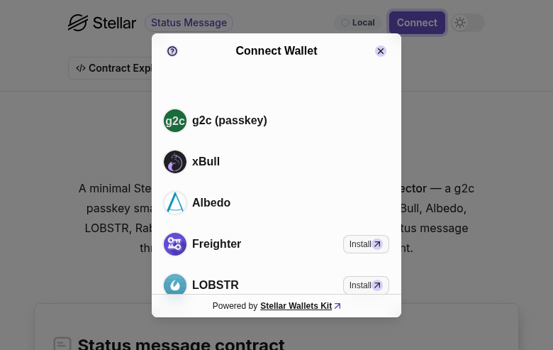

# Status Message dApp — a stellar-scaffold template with the Nido wallet selector

A minimal [stellar-scaffold](https://github.com/theahaco/scaffold-stellar) dApp
(React + Vite) that demonstrates a third‑party app connecting through the
[`@creit.tech/stellar-wallets-kit`](https://github.com/Creit-Tech/Stellar-Wallets-Kit)
**wallet selector** with the **Nido passkey smart account**
(`@nidohq/stellar-wallets-kit-module`) registered alongside the standard wallets
(Freighter, xBull, Albedo, LOBSTR, Rabet, Hana).

The app reads and writes an on‑chain **status message** through an automatically
generated TypeScript contract client. Writing requires the author's
authorization, so saving routes through whichever wallet you picked: a Nido
account signs with a passkey, classic wallets sign normally.



## What's inside

| Path | Purpose |
| --- | --- |
| `contracts/status-message/` | The Soroban contract (one `String` per account). A self-contained copy of `contracts/status-message` from the Nido repo root, with the historical `udpate_message` typo fixed to `update_message`. |
| `environments.toml` | Tells Scaffold to build + deploy the contract and generate a TS client for `development` (local) and `testing` (testnet). |
| `src/util/wallet.ts` | Configures the wallet selector: registers `NidoModule` first, then the standard wallets. |
| `src/util/moduleOrder.ts` | The pure "Nido first" ordering helper (unit-tested in `moduleOrder.test.ts`). |
| `src/components/StatusMessage.tsx` | The read/write UI, built on the generated client. |

## Prerequisites

- Node 20+, Rust (the pinned toolchain in `rust-toolchain.toml`), and the
  [`stellar`](https://developers.stellar.org/docs/tools/cli/install-cli) +
  `stellar-scaffold` CLIs.
- Install dependencies **from the repo root** (this example is a member of the
  repo's npm workspace, so it consumes the local `@nidohq/*` packages):

  ```bash
  cd <repo-root> && npm install
  ```

## Run it

```bash
cd examples/status-message-dapp
cp .env.example .env   # first run only
npm start
```

`npm start` runs `stellar scaffold watch --build-clients` next to Vite. Scaffold
builds the contract, deploys it to the network selected by `STELLAR_SCAFFOLD_ENV`
(`development` by default), and generates the client into `packages/status_message`
+ `src/contracts/status_message.ts`. Vite serves the app.

> **Committed client for the live demo.** So the GitHub Pages deployment can build with a plain
> `npm ci && vite build` (no Rust, no scaffold, no live RPC), the generated
> client for the deployed testnet contract is checked in: the `staging`
> environment binds `status_message` by id
> (`CBXVJXHPSYORSAHPX4I6NYPQMDJWK2STQCE6JTIM7FNV4OZSIDJFGNDM`) and
> `packages/status_message/` (source) + `src/contracts/status_message.ts` are
> tracked. Local `development`/`testing` runs still regenerate the client via
> `npm start`, overwriting it for the network you're on.
>
> **Staleness:** the committed client is pinned to that testnet id. If the
> contract is redeployed with an ABI change, the live demo silently breaks until
> the client is regenerated. To repoint the demo at a new deployment, update the
> `staging` id in `environments.toml` and re-run
> `STELLAR_SCAFFOLD_ENV=staging stellar scaffold build --build-clients`, then
> commit the refreshed `packages/status_message/` + `src/contracts/status_message.ts`.
> You can spot drift with
> `stellar contract info interface --network testnet --id <id>`.

### Local network (default)

`development` spins up a local Stellar container (`run-locally = true`). You'll
need Docker available.

### Testnet

Point at testnet by setting `STELLAR_SCAFFOLD_ENV=testing` in `.env` and
uncommenting the testnet `PUBLIC_STELLAR_*` block. Scaffold needs a funded
`testnet-user` identity:

```bash
stellar keys generate testnet-user --network testnet --fund
```

## Wallet selector & the Nido passkey

The picker shows Nido first, then the standard wallets. Nido is a **hosted**
wallet: the passkey ceremony runs at the Nido deployment, not in this app. Set
which deployment via `.env`:

```dotenv
PUBLIC_NIDO_BASE="https://nido.fyi"
```

`getAddress` opens `<base>/connect/` to pick a smart account; signing opens
`<account>.<base>/sign/` for the passkey ceremony. A classic Stellar transaction
cannot be signed by a Nido account (it's a contract), but the status-message call
is a Soroban invocation, which is exactly what Nido signs.

> Passkeys require a secure context. Serve the Nido deployment over HTTPS (or
> `localhost`); an insecure `http://<hostname>` origin disables WebAuthn.

## Tests & checks

```bash
npm test        # vitest: verifies Nido is registered first in the selector
npm run typecheck
npm run build
```

## Using this outside the repo

This example links the local `@nidohq/*` packages through the repo's npm workspace.
To lift it into its own project, swap the `@nidohq/passkey-sdk` and
`@nidohq/stellar-wallets-kit-module` dependencies from `"*"` to their published
versions, add a `"workspaces": ["packages/*"]` field back to `package.json` (so
the generated contract client resolves), and run `npm install` in the project.
